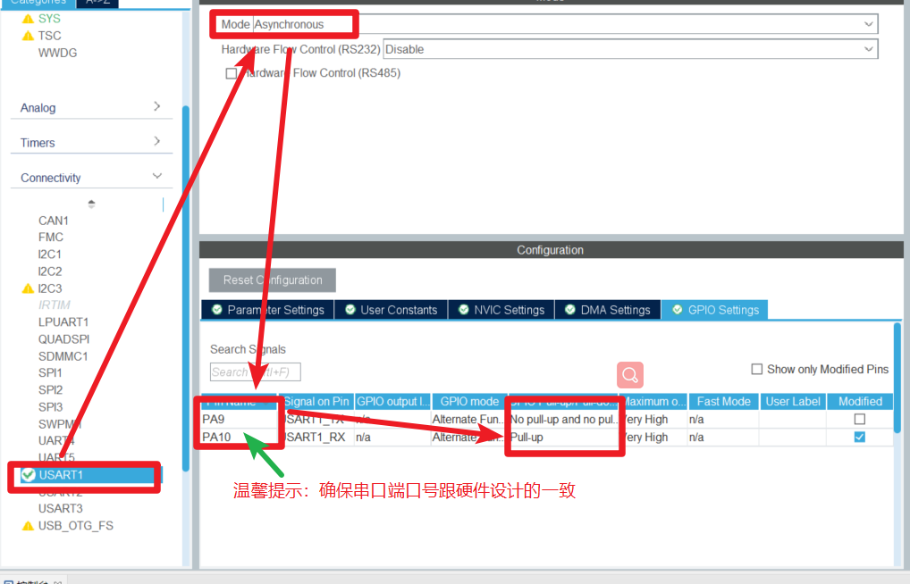
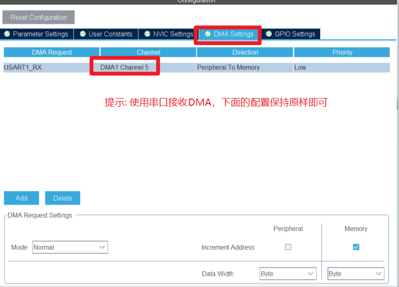
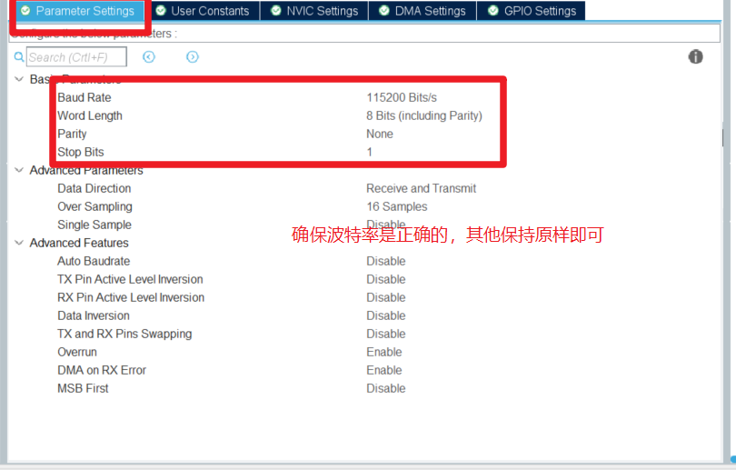
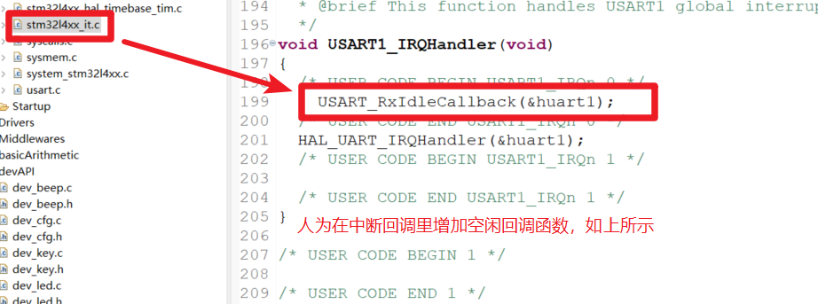

# USART

## 简介
​		通用串口程序是结合牧原嵌入式开发时成熟的套路提炼出来的库函数，该库函数由 "康国伟" 提炼出来，并考虑到某些项目是用裸机开发的可能性，因此对该代码有所修改，从而使得该程序无论是否使用操作系统，都能正常运行

## 配置步骤：
1. #### 通过cubeMX或STM32CubeIDE，配置你所需要的串口，下面以串口1为例进行配置(其他串口套路一样):

   

#### 2.把该README.md同级目录下的dev_usart.h和dev_usart.c 添加到工程里(指定头文件、添加include路径)

#### 3. 工程代码中激活该串口并进行初始化，具体方法如下:

#### 4.验证串口移植是否成功，如下图所示:

